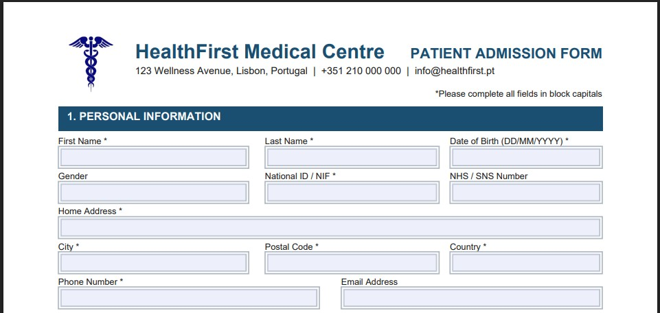
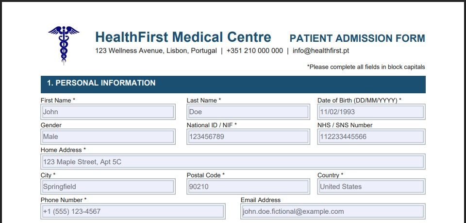
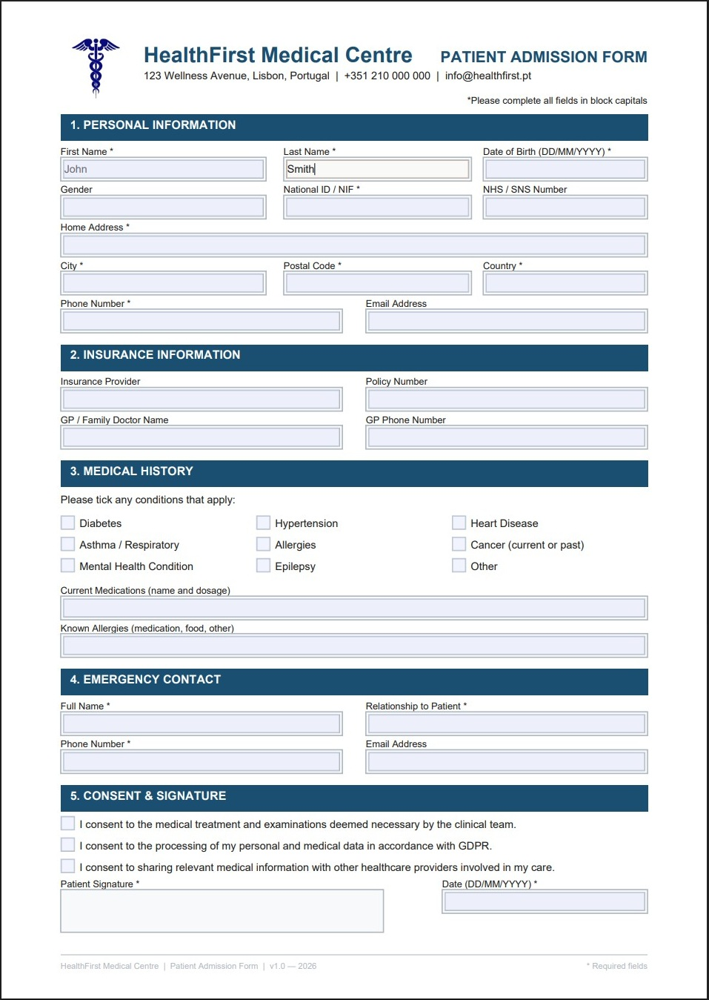

# Python Fillable PDF Form Generator

Generate professional, branded, fillable PDF forms directly from Python — with text fields, checkboxes, signatures, and pixel-perfect layout control.

*Status: April 2026*

This project is a **production-style example** of something that sounds straightforward but almost never is:

> *"Can't I just export a Word form to PDF?"*

---

#### ⚡ Quick Navigation: [The Problem](#the-problem) | [How it Works](#how-it-works) | [Form Preview](#form-preview) | [Quick Start](#quick-start) | [📩 Get in Touch](#need-a-custom-form-for-your-organisation)

---

## The problem

Every organisation has forms. Patient intake forms. Client onboarding forms. Employee records. Consent documents. And almost every organisation handles them the same way: a Word template, exported to PDF, sent by email, printed, filled in by hand, scanned back, and filed somewhere.

Each step in that chain is a place where data gets lost, misread, or delayed.

The alternative — a proper fillable PDF — sounds simple. Open Adobe Acrobat, add some fields, done. Except:

- **Acrobat Pro costs money.** Most teams don't have it.
- **Word-to-PDF form exports are unreliable.** Field positions shift. Fonts change. Checkboxes disappear.
- **You cannot automate a manual process.** If someone has to open Acrobat every time you need a new form variant, you haven't solved anything.

What you actually need is a form that is generated programmatically — from code, on demand, with full control over every field, every label, every pixel.

---

## What a fillable PDF actually is

A fillable PDF uses a standard called **AcroForm** — built into the PDF specification since 1996. Every major PDF reader supports it: Adobe Reader, Preview on macOS, browsers, mobile apps. No special software required to fill one in.

AcroForm fields are not images. They are interactive objects embedded in the file structure — text fields that accept keyboard input, checkboxes that toggle, signature areas that capture a digital mark. When the user saves the filled form, the data is stored inside the PDF file itself.

This is fundamentally different from a scanned paper form or a Word document exported to PDF. It is a proper digital form — one that can be filled on screen, submitted electronically, and processed automatically.

---

## How it works

Rather than relying on Acrobat or any external tool, this project generates AcroForm fields directly using **ReportLab** — a Python library that writes PDF files at the binary level.

The approach gives complete control over the output:

```
program.py
    │
    ├── draw_header()         — clinic branding, logo, form title
    ├── draw_personal_info()  — text fields: name, DOB, address, contact
    ├── draw_insurance_info() — text fields: provider, policy, GP details
    ├── draw_medical_history()— checkboxes: conditions, free-text fields
    ├── draw_emergency_contact() — text fields: name, relation, contact
    └── draw_consent()        — checkboxes: GDPR, treatment consent + signature area
    │
    └── Output: patient_admission_form.pdf
```

Each section is a self-contained function. The layout is coordinate-based — every field is placed at an exact position on the page, independent of any template engine or document flow. This makes the output deterministic: the same code always produces the same form.

---

## Form preview

### The generated form — empty



### Filled in a standard PDF reader



The form works in any PDF reader without plugins, special software, or an internet connection. Fields are editable. Checkboxes toggle. The signature area accepts freehand input in readers that support it (Adobe Reader, PDF Expert, and others).

---

## What the form contains

| Section | Fields |
|---|---|
| Personal Information | First name, last name, date of birth, gender, national ID, address, city, postal code, phone, email |
| Insurance | Provider, policy number, GP name, GP phone |
| Medical History | 9 condition checkboxes, current medications, known allergies |
| Emergency Contact | Name, relationship, phone, email |
| Consent & Signature | 3 GDPR/treatment consent checkboxes, signature area, date |

All field names follow a consistent naming convention, making it straightforward to read submitted form data programmatically using any PDF library.

### Generated Fillable PDF Form



---

## Why coordinate-based layout

Most Python document libraries use flow-based layout — content is placed in sequence and the engine decides where each element lands on the page. This works well for reports and invoices, where content length varies.

Forms are different. A form has a fixed structure. Every field must be exactly where the user expects it — aligned, consistent, predictable. Coordinate-based layout gives that guarantee. There is no reflow, no unexpected page break, no field that shifts because the label above it was one line longer than expected.

The trade-off is that the layout requires explicit positioning. This project shows how to manage that complexity cleanly — using helper functions, named constants, and a consistent coordinate system that makes the code readable and easy to modify.

---

## Quick Start

```bash
git clone https://github.com/hasff/python-fillable-pdf-form-generator.git
cd python-fillable-pdf-form-generator
python -m venv venv
source venv/bin/activate   # Windows: venv\Scripts\activate
pip install -r requirements.txt
python program.py
```

The form will be generated at:

```
output/patient_admission_form.pdf
```

Open it in any PDF reader to fill in the fields.

---

## Adapting the form

The configuration block at the top of `program.py` controls the visual theme:

```python
COLOR_PRIMARY  = HexColor("#1B4F72")   # header and section bar colour
COLOR_FIELD_BG = HexColor("#F8F9FA")   # text field background
MARGIN_LEFT    = 50                    # page margins
FIELD_HEIGHT   = 20                    # height of each input field
```

Each section is a standalone function. Adding a new field means calling `draw_text_field()` or `draw_checkbox()` with a name, label, and position. Removing a section means removing one function call.

The form is designed to be adapted — not just run as-is.

---

## Need a custom form for your organisation?

I build fillable PDF forms and document automation pipelines for:

- healthcare providers replacing paper intake and consent forms
- legal and compliance teams that need standardised, auditable document workflows
- HR departments automating onboarding and employee record collection
- any organisation that currently relies on Word templates, printed forms, or manual data entry

Every form is generated from code — which means it can be version-controlled, modified instantly, integrated with your existing systems, and produced at any scale without manual effort.

📩 Contact: hugoferro.business(at)gmail.com

🌐 Courses and professional tools: https://hasff.github.io/site/

---

## Further Learning

The ReportLab techniques used in this project — coordinate-based layout, AcroForm fields, branding and typography — are covered in depth in my course:

[**Python PDF Generation: From Beginner to Winner (ReportLab)**](https://www.udemy.com/course/python-reportlab-from-beginner-to-winner/?referralCode=3B927E883D2E868CF221)

The repository is fully usable on its own. The course provides the deeper understanding behind the decisions made here — including layout strategies, font handling, multi-page documents, and how to structure production-grade document pipelines.
